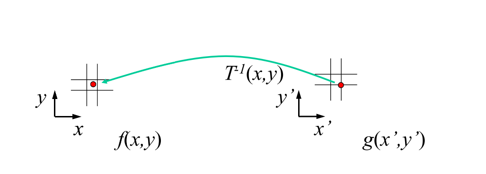

## 原理


两个不同的人物的面部合成不仅是一件有趣的事情，更是一个重要的任务。例如，在动画中如何让人物的变形能较为平滑自然与Face Morphing就息息相关。

一般来说，在合成两张图的时候一个直觉的想法是把两张图取个中间值。例如假设有两个不同颜色的同样大小的球的图片，我们对于每个像素使用$p(x,y) = (1-\alpha)\cdot s(x,y) +\alpha\cdot t(x,y)$就可以得到中间颜色，这种直观的方法称为Cross-Dissolve。然而，如果两张图片的形状不同，那么这样就会得到一种淡入淡出的结果（类似PowerPoint过场时截个图的感觉），作为过场特效这样或许还行，但是如果想做图像合成就有点差强人意了，直接的Cross-Dissolve看起来就是两张图半透明叠在一起。因为Cross-Dissolve实际上只是对颜色取中间值。

对于更为复杂的图像，我们希望除了颜色是平滑过渡的，形状也是平滑过度的，从而实现“变形”而非“淡出”的效果。

以人脸为例，如果要让A脸变形到B脸，我们希望各个面部特征平滑地变形。如果无视这种形变而直接对每个像素使用Cross-Dissolve的话很难得到满意的效果。因此，Face morphing的主要难点正在于让A人物面部的某部位能近似地对应到B人物的相同部位，并且描述其中的过程。

对简单Cross-Dissolve的一个改善思路是将图像分割成对应的小区块，对于不同的区域使用不同的映射关系——即像素线性空间的变换。显然当区块切得越贴近于面部特征，这些子线性空间的映射越能反应出“变形”的过程。

得益于近年计算机视觉工具的成熟，现在可以很方便地使用一些人脸识别工具完成特征点的标记。接着，就能从特征点集建面片集合完成对图像的分割。相比于方块之类的划分，基于相同特征点生成的“好的”面片集合是一种对于脸部局部特性的有效近似。

当源图像和目标图像各个子区域间的线性变换确立之后，就可以将图像“变形”，坐标变换后的图像可以直观地理解成两个“形状”相似的图，因此这时做Cross-Dissolve效果就像是前面说的对球做的Cross-Dissolve，其效果自然会好过于没有适当形变的暴力版。

## 实现

如前面所述，我们可以把Face Morphing分割成以下的子任务：

1. 人脸特征点识别
2. 三角面片生成
3. Affine Matrix（仿射矩阵）求解
4. 像素的Inverse Warping
5. Cross-Dissolve

### 特征点识别

我使用了Face++的人脸识别平台Web API，参考官方文档的代码便可以得到86个特征点，通过特征点标记的label可以确定源图像、目标图像之间点的对应关系。

### Delaunay Triangulation

像素点到像素点的坐标转换，可以透过将三角面片间的仿射矩阵乘上像素坐标得到新坐标。怎么从上一步得到的人脸特征点生成三角面片呢？在计算几何中这称为基于点集的三角剖分，有一个经典的三角剖分法：Delaunay Triangulation。

Delaunay 三角剖分的思路是这样的，首先我们希望各个三角面片的角度能尽量地均匀——即避免出现角度过小或过大的“尖锐”的三角形，一个Delaunay三角剖分就是任一个三角面片都没法透过翻转某个边使其能够变得更好的集合。不难证明，给定点集之后的Delaunay三角剖分是唯一的。

邓老师的计算几何课提到，可以使用Vonori图构造Delaunay Triangulation，但我这里使用了另一种称为Bowyer Watson算法的方法。

即对于任意的三角形，如果有某个点在其外接圆内，那么其必不是Delaunay三角形，因为我们可以将该点和原先三角形的三个边构成新的三角形，这种组合的外接圆将不会再包括另外的点。从初等几何的知识知道，缩小外接圆相当于使三个角的值趋近。

由此，可以采用以下伪代码的思路来实现Delaunay Triangulation：

```c++
function BowyerWatson (pointList)
      // pointList is a set of coordinates defining the points to be triangulated
      triangulation := empty triangle mesh data structure
      add super-triangle to triangulation // must be large enough to completely contain all the points in pointList
      for each point in pointList do // add all the points one at a time to the triangulation
         badTriangles := empty set
         for each triangle in triangulation do // first find all the triangles that are no longer valid due to the insertion
            if point is inside circumcircle of triangle
               add triangle to badTriangles
         polygon := empty set
         for each triangle in badTriangles do // find the boundary of the polygonal hole
            for each edge in triangle do
               if edge is not shared by any other triangles in badTriangles
                  add edge to polygon
         for each triangle in badTriangles do // remove them from the data structure
            remove triangle from triangulation
         for each edge in polygon do // re-triangulate the polygonal hole
            newTri := form a triangle from edge to point
            add newTri to triangulation
      for each triangle in triangulation // done inserting points, now clean up
         if triangle contains a vertex from original super-triangle
            remove triangle from triangulation
      return triangulation
```

> 伪代码参考：[Bowyer-Watson algorithm| Wikipedia](<https://en.wikipedia.org/wiki/Bowyer%E2%80%93Watson_algorithm>)

Delaunay Triangulation 生成的三角面片可视化后大概长这样：


### Affine Matrix（仿射矩阵）

知道了Delaunay Triangulation的方法后，由于源图像和目标图像的特征点定义方式是一样的，所以可以对源图像做一次三角剖分后维护一个三角形集合（记录顶点坐标对应哪些特征点），目标图像的三角剖分和源图像的一一对应（注意：目标图像的三角剖分可能不是严格的Delaunay Triangulation）。由于这种一一性，我们可以将问题转化为求两个三角面片间的线性变换（称为仿射矩阵）。


如图所示，由代数知识可以知道，在二维平面上当给定两个三角形的定点时可以唯一确定线性变换T（即仿射矩阵）。坐标的变换关系可以描述为：


令上式为$x' = Tx$，则若$p' = [x_1' \ x_2' \ x_3'] , p = [x_1 \ x_2 \ x_3]$分别为(3,3)的矩阵，则可得$T = p' p^{-1}$。由线性代数的相关知识得知，三角形ABC中任一点透过仿射矩阵T后都可以变换到三角形A'B'C'的对应点。

因此我们可以用如下方法计算出Delaunay Triangulation 里每个三角面片对应的仿射矩阵。

```python
def calAffineMatrix(src_mesh, target_mesh):
    l = len(src_mesh)
    affine_martix = []
    for i in range(0, l):
        src, target = src_mesh[i].vertex, target_mesh[i].vertex
        afMatrix = af.getAffineMatrix(src, target)
        affine_martix.append(copy.deepcopy(afMatrix))
    return affine_martix 
```

`af.getAffineMatrix`就是基于src和target两个顶点集合的坐标，根据上述数学关系计算仿射矩阵T，`affine_matrix`维护了Delaunay Triangulation中每个三角面片对应的仿射矩阵。

### Warping

有了仿射矩阵列表后，我们想知道图像中的每个像素应该应用哪一个仿射矩阵。这个问题相当于计算每一个像素属于哪个三角面片。我采用的方法是遍历Delaunay Triangulation中所有的三角形，然后对于三角形外接矩形内的所有像素分别判是否于三角形内，如果是的话就在全局的二维数组中记录`p(x,y)`对应的三角面片的编号，于是该像素就可以用这个编号去索引Affine Matrix中的相应项了。

> 求三角形包含的像素如果使用16分搜会比外接矩形快（特别是对于狭长型的三角形），但是由于图片不大且由于Delaunay Triangulation的良好性质，大部分的三角面片并不会白算太多像素，跑起来时间也还行，因此我就没有特别优化。

有每个像素和仿射矩阵T的关系之后就可以计算由源图像计算变形后的图像了，两种常见的方法包括：

#### Forward Warping


Forward warping枚举源图像的每个像素计算在Warping后的图像中的相应位置，由于变换不一定会是整数，所以可能会导致Warping后图像内某些点没有值。因此，一般采用另一种对偶方法。

#### Inverse Warping




Inverse Warping 和 Forward Warping的做法反过来，枚举Warping后图像中的每个像素，透过仿射矩阵的逆矩阵求得其在源图像中的对应点。由于源图像中每个像素值都是已知的，所以可以使用插值求得变换后的像素值。在我的实现中我用了双线性插值法：

```python
def interpolate(x, y, img):
    result = np.zeros((1,3))
    l_x, l_y = int(x), int(y)
    u_x, u_y = l_x+1, l_y+1
    if u_x > img.shape[0]:
        u_x = l_x
    if u_y > img.shape[1]:
        u_y = l_y
    u = x - int(x)
    v = y - int(y)
    result = (1.0-u)*(1.0-v)*img[l_x,l_y,:] + (1.0-u)*v*img[l_x,u_y,:] + u*(1.0-v)*img[u_x,l_y,:] + u*v*img[u_x,u_y,:]
```

### Average Shape & Cross-Dissolve

基于以上所述，已经可以将源图像（A人脸）映射到目标图像（B人脸）了，但是这样一来，Cross-Dissolve效果虽然还行，可是脸型会有些偏向B人脸。因此，还需要找出Average Shape。做法是给定源图像和目标图像的Triangulation，对于其中每个三角形的顶点$v, v'$套用$newVertex = (1-\alpha)\cdot v + \alpha\cdot v'$找到“中间”的三角剖分。

基于这个三角剖分，分别向源图像和目标图像做inverse warping得到对应的像素值，再使用$\alpha$加权相加（Cross-Dissolve），得到形状特征和颜色特征都位于中间的图像。

（如同开头中间的图片，该图参数$\alpha =0.5$

至此，Face Morphing就完成了。一般的图像Morphing类似，只需要明确好特征点的对应关系其他都差不多。

## Reference

1. [学堂在线 - 计算几何公开课 | 邓俊辉老师](https://www.xuetangx.com/courses/course-v1:TsinghuaX+70240183x_1+sp/about)
2. 清华大学《数字图像处理》课程 | 崔鹏老师