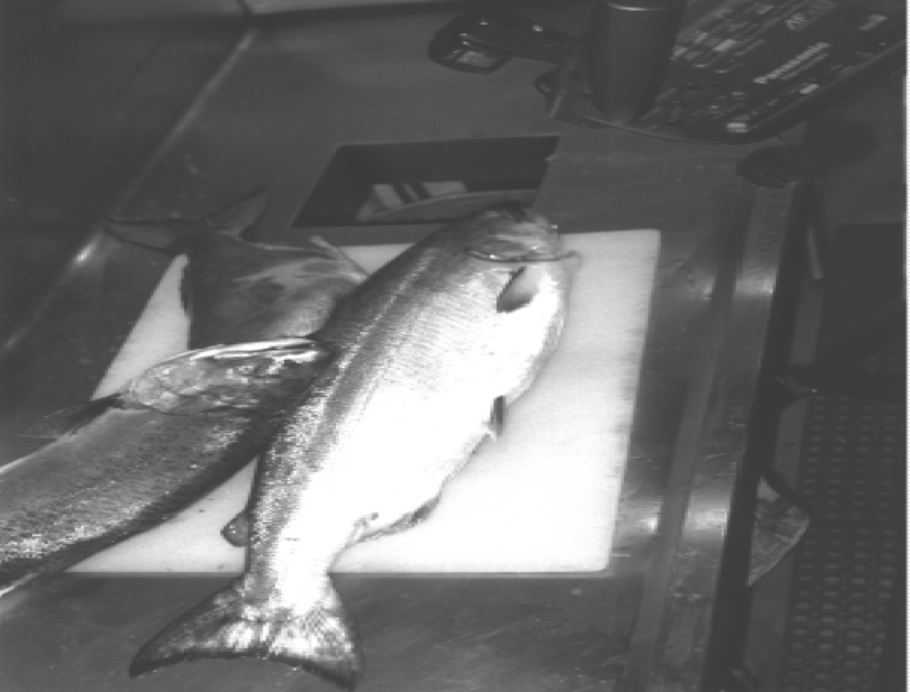

title: 模式識別介紹
tags:  [AI,模式識別]
categories: 'Computer Science'

date: 2019-02-27 19:36:16
---
這一篇（或是之後可能會有的系列記錄）博客是我現在在上模式識別課程的一個總結，剛佈置了Hexo感覺很酷所以就記錄了，希望不要三分鐘熱度哈哈，希望能讓博客多一點東西，自己也有所成長。
由於算是個半課堂筆記，博客的觀點和圖片可能來自於清華大學計算機系陶霖密教授。
# 什麼是識別？

當前的機器智能很大程度上可以歸結為分類問題，因此人工智能的智能化程度，可以視作是根據特征、模式對于物體的分類能力強弱。很多時候，我們判定AI能力時僅考慮他們能否正確地區分A和B，即機器的工作可以描述為separate object(s) from other objects, and/or background 的分類問題。
對於這個工作而言，語義信息並非關注的重點——不難想象，從一群狼里分辨出一隻狗所需要的信息應該小於精確定義「何為一隻狗」的信息量。因此，即使當前新的深度學習方法在分類的效率上有了顯著的進步，我們仍應當注意到語義信息的描述于人類智能里的重要地位以及當前機器在這一方面的缺失。

# Classification

> Classification: to use the feature vector provided by the feature extractor to assign the object to a category.  

Classification是人工智能的一個典型應用場景，例如一個遠洋漁夫在工作時會將捕獲到的不同魚種扔到不同箱子中，這樣的分類問題有時可以運用計算機視覺完成。然而現實中往往會遇到更為複雜的分類問題，例如考慮以下這張圖：

不難發現，照片中有三條不同的魚，然而三條魚的邊界是重疊的，這讓前後景和目標物的切割變得困難。假定我們能切割出三條魚，仍有另一個問題妨礙機器完成分類任務。
以分類魚的問題為例，我們可以將人工智能的分類流程描述為以下幾個階段：

1. 根據Sensor獲得原始數據（例如照片），這個階段的傳感器確定了所能獲取的信息量
2. 從原始數據提取特征
3. 將特征轉換成特征向量
4. 計算特征向量、學習特征，模式識別的理論主要關於這個階段。
5. 給出分類/預測。

違反直覺的是，從這個角度來看分辨魚這個（對人類而言）「容易」的事實際上比起「困難」的棋類遊戲更為複雜。以圍棋為例，每一時刻圍棋棋盤的狀態天然地就是一個可處理的特征向量——可能是一個19* 19 * 2 維的張量，我們可以直接基於其去做計算。而魚這個簡單任務，則在提取特征并轉化為特征向量這個階段上有更多要考慮的，很多時候其直接影響分類結果。

> 當然，圍棋AI的任務和分類問題並不相同，所以這樣的類比可能是不甚嚴謹的，此處僅是用其表達現實中的任務和一些人為場景的任務之間存在著特征提取這個重要的區別。對棋類AI有興趣的人可以查看AlphaGO相關論文，或是參閱我之前一個關於四子棋的課程小作業（如果我有整理上來的話(:з」∠)）  

# 特征選取的重要性

在人工智能領域，廣為被人關注的問題是：什麼是一個好的學習算法？梯度會消失嗎？如何降低learning cost等等。人們對於網路結構以及超參數投入了大量的熱情，相對而言較少引人注意的是特征選取對結果的影響，然而這件事在解決現實問題時也是至關重要的。
一個顯而易見的例子是，如果以人的衣服為特征來識別人，不管用什麼算法都難以完成人的分類問題——畢竟人可以換衣服。所以在人工智能的優化上，一個容易被忽視的困難問題是：如何正確地理解并提取目標物的核心特征。再以魚為例子，對於新鮮的魚和腐敗的魚的分類問題，從計算機視覺解決這個問題會變得十分困難（當然，這還是可能的），然而如果使用化學傳感器以氣味為特征，顯然分類效果會好很多（即使使用的是樸素的算法）。
像是下面這張圖說明了，當特征選取合適時（例如 lightness, width），分類函數可能相當簡單優美。

而如果想要優化效果時有兩個方法：

1. 選取更代表性的特征，可能這兩種魚類的寬度並沒有那麼顯著的區別，或許換個特征重新繪圖后直線兩側錯誤歸類的樣本會下降。
2. 換個算法，重新挑選一個可以讓cost下降的函數。

可以看到新的分類函數複雜且似乎有點tricky，但是實際上這種tricky的做法很多時候是work的，也有很多人研究出好些東西。不過仍然需注意到，那並不是人工智能的全部。模式識別將更多地關注特征提取的問題，即最前面提及的語義問題。
之後會閱讀幾篇關於Feature extraction 的論文，并且總結一下他們的方法（吧

>  Sensation, Perception, Recognition 
