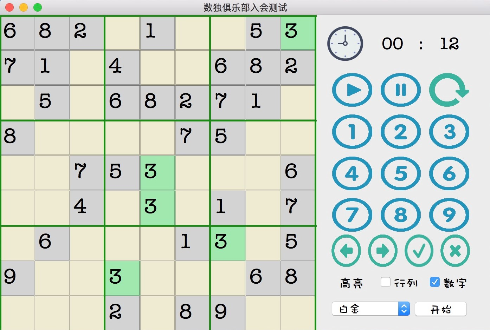

> This is a simple portfolio of my projects and I will gradually implement the detail of them. If the portfolio gets too long in the future, I will consider to construct another website to demonstrate it, but I think it hasn't been a problem yet. If you're browsing with desktop mode, please use the table of the content on the left to directly access a specific paragraph.

# Arena X

It is the second generation platform for the Artificial Intelligence Competition of Tsinghua University. Arena X was mainly maintained by Student Science Association of the Department of Computer Science and Technology. It aims to provide a flexible and easy-to-use platform to hold A.I. competition. I was the main developer of the game-server module and its CI/CD, which enables the developer to deploy their A.I. game in any programming language on the platform.

Besides, Arena X provides these features:

1. Multiple online/off-line player contest
2. Online source code compilation and AI script management
3. Flexible game server deployment. One can easily add new server to handle increasing players without restarting the platform.
4. AI game downloading and updating
5. Customizable ranking for different contest.
6. Other basic features of a game platform such as user info, friends invitation, room contest, news and etc.

**Programming Skill**: Node.js + Koa + Vue.js + Electron

**NOTE**:

* Source code is maintained on the private GitLab repo of Tsinghua CST.
* The new website is still in progress and it will be released with Arena X when the AI competition of 2019 starts. This is the link to old website and the first generation platform: [Arena 9](https://arena.net9.org/).

# Troy Uncalm: An AI war chess game

Troy Uncalm was one of the game for 22th A.I. competition of Tsinghua University. It was a war chess game for A.I. player. I was one of the four member team and I wrote most code related to the Unity3D. We designed the rules and testing the game balance by our own. Troy Uncalm was deployed on Arena 9 and used for the first round competition.

**Programming Skill**: C# / Unity3D

# Air Typing

<iframe width="560" height="315" src="https://www.youtube.com/embed/cSZycJAUFfo" frameborder="0" allow="accelerometer; autoplay; encrypted-media; gyroscope; picture-in-picture" allowfullscreen></iframe>

This is the project of the human-computer interaction course. It is based on Leap Motion2 and Unity3D. We followed the method mentioned in "ATK: Enabling Ten-Finger Freehand Typing in Air Based on 3D Hand Tracking Data" and make some improvement. On the other hand, we implemented some easy-to-use gestures for common usage in typing, such as cursor moving and selection. You can see them in the video. 

We designed a simple input method algorithm based on possibility distribution rather than fixed clicked position and it greatly reinforced the robustness of our system. Finally, we achieved around 15 WPM and it was closed to the result in the paper.

**Programming Skill**:  C#, Unity3D

# Object Detection on the Intel Movidius Neural Computing Stick

It was the project during my 6-week internship in [Xvisio Tech](http://xvisio.org/), California. My main mission was designing and developing a pipeline of object detection on Xvisio's product, xSLAM, which was a 6-DOF sensing component in VR/AR and robot solutions. The work I had done included:

1. Investigating and comparing different machine learning model under hardware limitation.
2. Raw data processing with Python.
3. Fine-tuning MobileNet-SSD for the warping dataset.
4. A useful pipeline which enables the user to train, test, and deploy without modifying the source code
5. Enable the users to determine the core number used in object detection task. 

Besides, I wrote part of a simple interaction demo of xSLAM with Unity3D with another intern as well.

This project is in commercial usage and therefore the source code is not public. As I know, it was still in use and maintained even after I left.

**Programming Skill**: Python / Shell Script / Caffe / C

# Single User SQL Database

It was the coursework of database introduction in THU. The requirement of this project is similar to [Stanford CS346](https://web.stanford.edu/class/cs346/2015/redbase-rm.html#intro). As Tsinghua's database course does not have its own English page yet, you could read Stanford's introduction to learn more detail of this project.

The SQL database I wrote supports these features:

1. Command line interface that allows user to create/drop database with SQL commands
2. Use SQL commands to insert/update/delete/find the record
3. Indexing the database with B+ tree

It was a 10000 ~ 15000 lines C++ project and managed with CMake tools. Google unit test framework was also applied.

**GitHub**: [simple-sql-database](https://github.com/AlexFxw/simeple-sql-database)

# Pinyin Input Method

It was a 2-week homework for AI introduction course which was able to recognize "pinyin" and transfer them into correspond Chinese sentences. This input method was based on Hidden Markov Model and two-word assumption. It achieved relatively good performance in news material. The algorithm did better in recognizing a longer sentence.

**GitHub**: [simple-pinyin-input](https://github.com/AlexFxw/simple-pinyin-input)

# THINPAD

THINPAD was a hardware project. It was the course project of Computer Architecture lesson which required us to wrote a basic CPU that supports MIPS. I finished it with another 2 classmates in three weeks. Our THINPAD supports most features of a "computer", includes:

1. 5-stage pipeline CPU
2. UART communication with the PC
3. Memory management
4. VGA output
5. TLB and branch prediction
6. Bubbling and hazard for command conflicts
7. Flash drive

**GitHub**: [ThinPad](https://github.com/AlexFxw/THUCS_ThinPad)

# Sudoko Game

A simple Sudoko game and solver based on Qt. It was a 1-week homework for summer semester. 

**Source code**: [Sudoko](https://github.com/AlexFxw/SudukoGame)

# Other projects

In addition to those projects listed above, I had also done these below. Some of them are just a simple homework. I may implement the details in the future.

**MNIST mission**: A handwrite number recognition task on Tensorflow

**RSS Reader**: An Android RSS reader. It was the coursework of 3-week Java lesson.

**Wiki Spider**: A Django project that re-render the information sprawled from the Wikipedia.

**Rubik's Cube Solver**: A simple C++ program that could give the solution from a given state of a Rubik's cube.

**Werewolf Game**: The project of OOP course. It was a 2-player online werewolf game.

**Basic Router**: A basic router that supports RIP

**Decaf Compiler**: The course project of compiler principle. It was wrote in Java.

*To be continued*